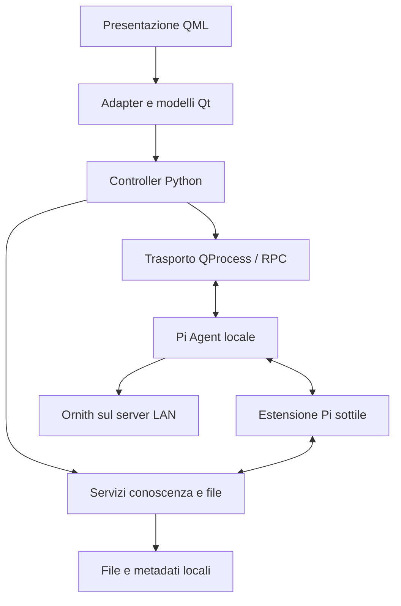

# Architettura proposta

Stato: progetto da implementare. I nomi di moduli e API in questo documento sono proposte, non API esistenti. Il contratto vincolante è [AGENTS.md](../AGENTS.md).

## Confini di esecuzione

GUI Python/Qt, Pi e strumenti che lavorano sui documenti girano sul desktop dell'utente. Il server LAN ospita l'inferenza Ornith. Workspace e software sono directory distinte: il primo contiene dati personali, il secondo codice versionato pubblicamente.

Le frecce indicano comunicazione/responsabilità, non chiamate sincrone obbligatorie. Il canale estensione–Python va progettato in M2: non è una funzionalità del protocollo RPC standard da presumere esistente.

## Struttura del codice prevista

| Percorso proposto | Responsabilità |
|---|---|
| `main.py` | Wiring QApplication, servizi, controller, engine e lifecycle |
| `core/agent/` | Tipi, parsing RPC, stato, correlazione richieste e interfaccia trasporto |
| `core/workspace/` | Identità documenti, operazioni file, revisioni, conflitti e cestino |
| `core/knowledge/` | Estrazione, ricerca, contesto selettivo e risoluzione fonti |
| `core/memory/` | Provenienza, decisioni e aggiornamenti della conoscenza |
| `core/settings.py` | Unico store della configurazione applicativa |
| `controllers/` | Coordinamento dei casi d'uso, senza duplicare servizi |
| `ui/adapters/` | Slot/proprietà/signali focalizzati per chat, file e settings |
| `ui/models/` | Modelli Qt per messaggi, strumenti, sessioni, risultati e albero file |
| `ui/native/` | QProcess, dialoghi/piattaforma, apertura URL e shutdown Qt |
| `ui/qml/` | Theme.qml, componenti e schermate |
| `ui/qml/shaders/` | Solo eventuali shader sorgente e relativa procedura di bake |
| `integrations/pi/` | Estensione TypeScript minima, risorse e contratti Pi |
| `tests/` | Test core/controller/UI, fixture sintetiche, integrazione e smoke |

Creare moduli quando nasce la responsabilità, senza scaffold vuoti per tutto il progetto. Non introdurre due implementazioni Python e TypeScript dello stesso algoritmo.

## Proprietà dello stato

| Stato | Proprietario canonico | Proiezione/derivazione |
|---|---|---|
| Cronologia, rami e compattazione delle sessioni | Pi e i suoi file di sessione | Modelli Python/Qt ricostruiti tramite API e letture compatibili |
| Richieste RPC pendenti e processo | Servizio agent Python | Stato visibile negli adapter |
| Originali, note e contenuti | File del workspace | Testo estratto e indice ricostruibili |
| ID documenti, relazione path/revisioni e provenienza | Metadati persistenti gestiti dal WorkspaceService | Modello albero, recenti e risultati |
| Revisioni e cestino | Store revisioni del WorkspaceService | Diff e anteprima |
| Decisioni, obiettivi e conoscenze confermate | Note/registri aperti gestiti da servizi Python | Indice di ricerca e contesto agente |
| Preferenze UI, endpoint, layout salvato | Settings Python | Binding QML; nessuna scrittura diretta |
| Bozza editor recuperabile | Servizio documenti Python | Buffer di editing QML transitorio |
| Hover, animazioni, selezione testo | QML | Non persistente |

Non modificare direttamente una sessione attiva di Pi. Un eventuale catalogo dei file di sessione è una cache ricostruibile; va confrontato con le API disponibili nella versione fissata. I token accumulati della sessione non sono automaticamente l'occupazione attuale del contesto.

## Integrazione Pi

Usare `pi --mode rpc` con stdin/stdout JSONL e QProcess asincrono. La documentazione verificata distingue risposte ai comandi ed eventi successivi. La GUI deve derivare il completamento dal lifecycle del turno e gestire separatamente rifiuto prima dell'accettazione e fallimento successivo. [RPC ufficiale](https://github.com/earendil-works/pi/blob/main/packages/coding-agent/docs/rpc.md)

Il parser tratta byte/frame incrementali, limiti e record sconosciuti. Stato proposto: processo `stopped/starting/ready/stopping/failed`; turno `idle/running/cancelling/failed`, con richieste pendenti correlate per ID. Tenere distinti stato processo, attività del modello e stato del server per evitare booleani contraddittori.

Un errore di connessione non autorizza a inviare nuovamente il prompt: prima si ricostruisce l'esito tramite stato/sessione. Shutdown: fermare nuovi job, gestire coda/abort e richieste UI pendenti, attendere asincronamente entro timeout, terminare/escalare i processi posseduti, verificare i figli e salvare stato. Non terminare il server LAN condiviso.

La baseline sceglie API/provider; `models.json` è una configurazione Pi prodotta dal servizio settings, non un secondo editor concorrente dei medesimi valori. Non importare espressioni eseguibili per credenziali da file non fidati. Isolare configurazione dell'app senza sovrascrivere quella globale dell'utente. [Modelli Pi](https://github.com/earendil-works/pi/blob/main/packages/coding-agent/docs/models.md)

Per gli strumenti di conoscenza, preferire un'estensione Pi che inoltra richieste tipizzate a un endpoint IPC posseduto dall'app (socket locale da valutare rispetto a un helper subprocess). Vincolare accesso al processo/sessione autorizzati, schema, dimensioni, cancellazione e lifecycle. La scelta del trasporto richiede una piccola prova in M2; Python rimane unico proprietario di ricerca e policy. Le estensioni TypeScript sono supportate da Pi. [Estensioni ufficiali](https://github.com/earendil-works/pi/blob/main/packages/coding-agent/docs/extensions.md)

## Persistenza, concorrenza e recupero

Configurazione e stato applicativo seguono XDG; la radice documentale è scelta dall'utente. Metadati di identità/provenienza sono dati canonici da includere nel backup. Cache estrazione/indice sono eliminabili e ricostruibili. Esportazione e backup devono includere le informazioni necessarie a mantenere citazioni e revisioni, non soltanto i file visibili.

Operazioni file con validazione path, hash atteso, snapshot precedente, scrittura atomica dove supportata e journal di recupero per operazioni che attraversano filesystem e database. Un rename su disco e una transazione SQLite non formano da soli una transazione atomica unica. Provare crash tra le fasi e riconciliazione al riavvio.

Watcher con debounce e riconciliazione rileva modifiche esterne. I worker di estrazione sono invalidati quando cambia la revisione: un risultato tardivo non può sovrascrivere l'indice della versione nuova. Limiti su memoria/dimensioni/tempo e cancellazione per file problematici. Aggiornare modelli Qt nel loro thread, applicando batch da risultati dei worker.

Scelta iniziale per le revisioni: snapshot locali indirizzati per hash e metadati espliciti. Git obbligatorio nel workspace aggiungerebbe conflitti e gestione del repository a documenti non tecnici; riconsiderarlo solo su esigenza concreta. Snapshot non significa backup: serve una copia separata verificata.

## UI e accessibilità

Sinistra conoscenze, centro chat prioritario, destra documento/diff richiudibile; conversazioni secondarie. Noto Sans per il contratto attuale. News Aggregator è riferimento visivo, non una dipendenza runtime.

ListView virtualizza la chat, QAbstractListModel espone messaggi/attività, QAbstractItemModel gerarchico alimenta l'albero lazy. Renderizzare soltanto output necessari; contenuti grandi hanno anteprima limitata e apertura completa dedicata. Non annidare effetti pesanti in ogni messaggio o nodo.

Scorciatoie previste: invio, nuova riga, stop, ricerca, apertura file e salvataggio; definire combinazioni coerenti e testarle su KDE. Focus di ritorno dopo dialoghi, ordine Tab, splitter da tastiera e nomi Accessible fanno parte del gate M1. Font scale e pannelli salvati passano dagli adapter ai settings Python.

## Accessi e trust

Il workspace è una radice organizzativa, non una sandbox. Gli strumenti Pi e la shell hanno i diritti del processo; validare soltanto i path della GUI non li confina. Documenti importati sono dati non fidati e non devono installare estensioni o ridefinire automaticamente istruzioni operative.

La documentazione Pi prevede regole di trust anche per risorse locali e comportamento specifico in RPC. Caricare esplicitamente soltanto le risorse applicative previste e verificare il comportamento della versione fissata. Non abilitare globalmente ogni progetto per aggirare una mancata discovery. [Trust e contesto Pi](https://github.com/earendil-works/pi/blob/main/packages/coding-agent/docs/usage.md#project-trust)
