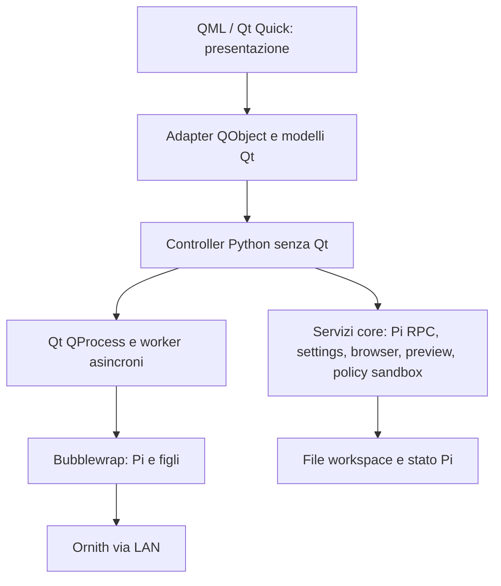

# Architettura Pi_UI: implementato e pianificato

Aggiornamento: 17 settembre 2026. **M0 è stata verificata con la policy precedente; M1 è incompleta.** Questa pagina distingue esplicitamente i componenti presenti da quelli della roadmap. Per le modifiche di sicurezza introdotte dalla PR di audit e i loro gate ancora aperti, leggere [AUDIT_REMEDIATION.md](AUDIT_REMEDIATION.md). Il contratto di sviluppo è [AGENTS.md](../AGENTS.md).

## Confini effettivamente implementati (M0 e slice M1)

- `main.py`: wiring di QApplication, SettingsStore, controller, adapter/modelli, `QQmlApplicationEngine`, runner nativi e shutdown. Non contiene logica di dominio.
- `core/agent/`: RPC, bootstrap, discovery/configurazione dei profili, specifica di lancio, gestione protocollo e recovery. Pi conserva le sessioni canoniche; la cronologia Qt è una proiezione, non una seconda persistenza.
- `core/settings.py` e `core/atomic_file.py`: settings tipizzati, percorsi XDG, migrazioni, quarantena delle configurazioni malformate e scritture atomiche delle impostazioni.
- `core/sandbox.py`: politica di mount Bubblewrap unica per Pi e gate; `core/preflight.py` e `core/sandbox_gate.py`: pianificazione e verifica dell'ambiente. Il launcher in `core/agent/runtime.py` rifiuta l'avvio diretto quando la sandbox è disabilitata.
- `core/workspace_access.py`, `core/workspace_browser.py`, `core/workspace_document.py`: path relativi confinati, scansione lazy e preview di file UTF-8. La preview rifiuta symlink, file non regolari, binari e file oltre il limite; **non modifica documenti**.
- `controllers/`: `AgentController` gestisce workspace, profili, collegamento, sessione e transcript; controller separati gestiscono browser, preview, preflight e sandbox gate. `AgentController` è ancora un debito di dimensione/responsabilità da ridurre senza rompere le API.
- `ui/adapters/` e `ui/models/`: QObject con slot/proprietà/segnali e `QAbstractListModel` con ruoli stabili. L'attuale albero lazy è volutamente una **lista piatta con ruolo `depth`**, non un `QAbstractItemModel` gerarchico. Cambiarlo soltanto se misure e casi d'uso lo richiedono.
- `ui/native/`: QProcess per Pi, runner Qt per scansioni/preview, probe e deadline, shutdown e integrazione host. I worker non aggiornano direttamente i modelli QML.
- `ui/qml/PiUI/`: shell, chat virtualizzata, Knowledge, DocumentPanel e componenti dark neumorphism. QML non possiede impostazioni, policy filesystem, sessioni persistenti o networking.

### Proprietà dello stato

| Stato | Proprietario attuale | Note |
| --- | --- | --- |
| Cronologia e rami di chat | Pi e file di sessione in `.pi-agent/sessions` | `AgentController` espone soltanto la proiezione e la recovery; non modificare direttamente JSONL. |
| Connessione, turn e selezione modello/workspace | `AgentController` | UI tramite adapter e segnali. |
| File e contenuti originali | File reali dell'AIOS workspace | Browser/preview leggono tramite servizi Python; nessun database documenti canonico ancora presente. |
| Selezione e testo della preview | `WorkspaceDocumentController` | Stato di presentazione ricavato dai file; il buffer Qt è sola lettura. |
| Impostazioni applicative | `SettingsStore` | Le sessioni Pi non vengono replicate nello store delle impostazioni. |
| Hover, animazioni, scroll e bozza del composer | QML | Solo stato di interazione temporaneo. |

## Sicurezza: policy nuova, gate ancora aperto

Bubblewrap isola Pi e i suoi figli mentre la GUI resta nel desktop host. `--unshare-all --share-net` permette LAN e Internet se richiesti dai tool: **non è un firewall di uscita**. Il processo Pi non riceve HOME reale, D-Bus, socket Wayland/SSH/GPG o le altre directory personali. `/usr` e il runtime Pi sono montati in sola lettura; `/tmp` è temporaneo e `/home/aios` è sintetico.

La modifica post-audit monta `/workspace` **in sola lettura** e crea un unico bind in scrittura per `/workspace/.pi-agent`, necessario alle sessioni e alla configurazione di Pi. La preparazione rifiuta directory di stato symlink e configurazioni senza sandbox; non è una promessa di versionamento. Le scritture autonome dell'agente sui documenti restano disabilitate finché non sono dimostrate revisioni prima della scrittura, rilevazione dei conflitti, rollback e protezione di ogni tipo di tool. I dati in `.pi-agent` sono ancora modificabili dall'agente e richiedono una strategia distinta di integrità/backup.

**Evidenza:** il gate CachyOS/Wayland del 9–10 settembre ha verificato la precedente policy con workspace scrivibile. Non valida automaticamente la policy attuale. Eseguire i nuovi test effettivi con documenti sintetici prima del merge; i test statici degli argomenti di Bubblewrap e la CI offscreen non equivalgono a un namespace reale sicuro. Vedi [VALIDATION.md](VALIDATION.md).

## Processo, timeout e recovery effettivi

Pi viene eseguito con `--mode rpc` su stdin/stdout JSONL tramite QProcess Qt. Gli ACK dei comandi sono distinti dal completamento dei turn; lo stato incerto impedisce replay automatici. Il watchdog di inattività non deve essere confuso con un hard timeout del modello lento. L'app possiede un `session-id` esatto; `--continue` globale non è usato. Un failed turn viene recuperato attraverso primitive pubbliche di session tree/fork, senza modificare la sessione JSONL. Lo shutdown gestisce escalation dei processi posseduti; non termina il server LAN condiviso. Questi comportamenti sono stati provati in M0, ma le regressioni applicabili vanno ripetute per le modifiche al launcher.

## UI, performance e accessibilità

La chat e il browser utilizzano `ListView` e `reuseItems: true`. I modelli dati arrivano da Python; non replicare collection grandi in array JS o aggiungere effetti pesanti ai delegate. I token sono centralizzati in `Theme.qml` (RGB 20/20/20, accento RGB 255/102/0, Noto Sans, raggi 28/22/16/12). `RaisedSurface` e `InsetSurface` incapsulano gli effetti. Semantica della tastiera, ordine Tab, contrasto, focus e resa delle ombre richiedono verifica reale su KDE/Wayland. Usare `/proc/<pid>/smaps_rollup` per PSS: non esiste una baseline completa di memoria misurata per M1.

## Componenti *previsti*, non ancora implementati

- **M1:** importazione, creazione/rename/move, editor e draft recuperabile, snapshot pre-scrittura, conflitti, diff/revisioni e ripristino; conversazioni/gestione di Pi dalla GUI. La preview attuale non è un editor.
- **M2:** `core/knowledge/`, estrazione e ricerca, citazioni risolvibili, eventuale estensione TypeScript sottile per invocare servizi Python via un IPC progettato e verificato. Nessun indice o gateway IPC operativo oggi.
- **M3:** `core/memory/` e registri di decisioni/obiettivi con provenienza e data. Nessuna memoria semantica persistente implementata oggi.
- **M4:** strumenti, routine, integrazioni ed eventuali subagent su esigenze reali.
- **M5:** installer idempotente, update manager con staging e rollback, backup/restore, distribuzione, benchmark PSS e gate grafici/performance riproducibili. `install.sh` non esiste ancora.

Per il futuro, mantenere identità documentali, revisioni e provenienza in un servizio Python autorevole; SQLite/FTS5 e storage snapshot sono scelte da validare, non moduli già esistenti. Gli indici sono derivati; una transazione SQLite e un rename filesystem non sono un'unica transazione atomica. Nessun watcher post-scrittura può ricreare retroattivamente un originale già sovrascritto. Backup significa copia separata con restore provato, non soltanto revisioni locali.

Decisioni e alternative: [DECISIONS.md](DECISIONS.md). Milestone e prove: [ROADMAP.md](../ROADMAP.md), [M1_PROGRESS.md](M1_PROGRESS.md), [VALIDATION.md](VALIDATION.md).
